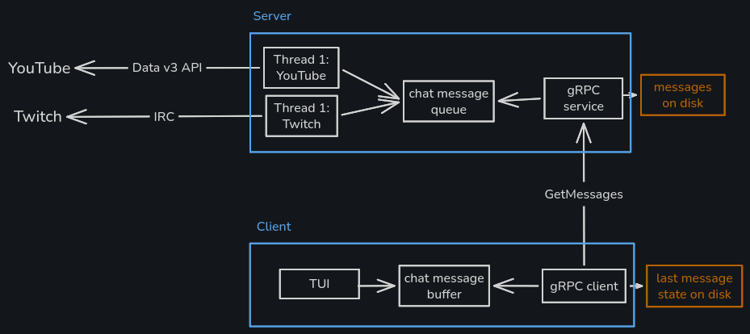

# stream-chat

A utility that makes it easier to read every message from chat. Works for YouTube, Twitch, or both.

Collects chat messages and lets you acknowledge each message one at a time.

## Installation

```shell
cargo install stream-chat
```

## Usage

1. Create a `config.json` file

```json
{
  "twitch": {
    "channel": "<twitch channel>"
  },
  "youtube": {
    "api_key": "<your api key>",
    "channel_id": "<channel id>"
  }
}
```

### Simple setup

Just run `stream-chat`

### Advanced setup

You can run `stream-chat-server` on a separate machine, and then `stream-chat-client` on your streaming PC.

If your streaming PC goes offline, crashes, or you need to reboot, you won't lose your position in the chat.



## Original Design Spec

We're constructing an application which will ingest Youtube and Twitch chat
messages (one or both), put those messages into a queue, and then show a
maximum of N messages at a time with the streamer having to acknowledge
messages in order to progress through the chat.

The application will have a server and client, which will talk to each other
via grpc. The server will run a thread for each chat ingest. The threads will
receive one end of a channel to send the messages into. The receiver will run
in another thread, and this will write to a piece of memory that holds all the
messages.

The grpc server will answer by giving back a batch of N messages.
The grpc client will request N messages.
The grpc client will implement a TUI where it displays N messages at a time.
The TUI will have buttons for acknowledging the latest message displayed,
i.e. when a button is pressed, the message at the bottom is purged, and another is brought in.
In order for this to work smoothly, the client will have to hold 3x N messages,
and fetch 33% more when it reaches 66%, in a background thread after a message is acknowledged
